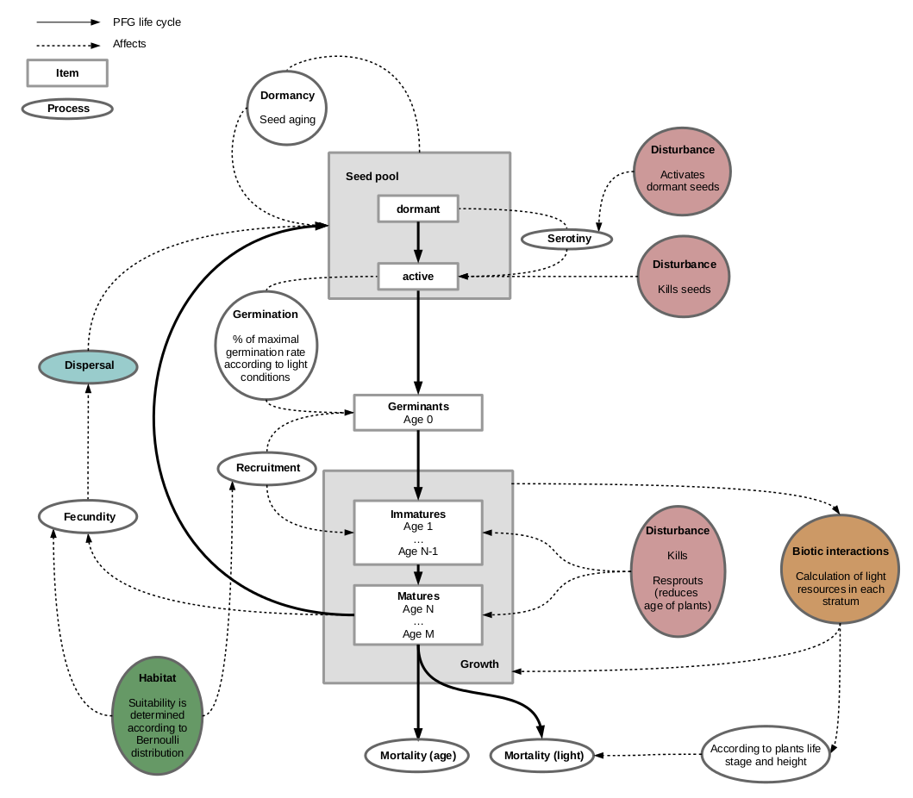

---
output:
  html_document:
    theme: lumen
    highlight: zenburn
    number_sections: no
    toc: yes
    toc_float:
      collapsed: false
      smooth_scroll: true
---

 
 

For more details, please check [Boulangeat, 2014](papers/Boulangeat_2014_GCB.pdf "Boulangeat, I., Georges, D., Thuiller, W., FATE-HD: A spatially and temporally explicit integrated model for predicting vegetation structure and diversity at regional scale. Global Change Biology, 20, 2368–2378.") or the [Publications page](https://mayagueguen.github.io/FATE-WEBSITE/publications.html).

  

## Global view

 

### Conceptual diagram of `FATE-HD`

The whole area is divided in grid-cells in which an independent **succession model A)** regulates the PFG life cycle. 
PFG abundances are structured by age into cohorts and each cohort is attributed to a height stratum according to the growth parameters.

Four submodels affect this cycle at various levels :

**B) Shading** regulates interactions between cohorts affecting germination, recruitment and survival.

**C) Habitat suitability** affects the recruitment and fecundity rates.

**D) The seed dispersal model** makes `FATE-HD` spatially explicit by connecting grid-cells.  
It depends on the amount of seeds produced by mature plants and affects each PFG’s seed bank in each cell.

**E) Disturbances** affect PFG survival and fecundity.

 

  

### Life cycle of each PFG within `FATE-HD` and influences from sub-models

Only three age classes are considered : germinant, juvenile and mature.

The **recruitment** is influenced by the habitat suitability and the biotic interactions.

**Mortality** occurs when light or soil conditions are not favorable or when the PFG completes its life span.

In addition, the disturbance regime directly affects juvenile or mature PFG and may for instance result in PFG death, impede **seed production** by reducing mature PFG age to N-1, or **revitalize senescents** by reducing their age to M-1.

 

   

## Source code

 

### Class diagram

A `FATE-HD` simulation is based on a map whose pixels each contain a succession model (`SuFate`). This model can depend or not on habitat suitability (`SuFateH`).

All the pixels are linked together by the dispersal model (`Disp`).

Input parameters are given to the software via the simulation parameter file (`FilesOfParameters`) which contain global (`GlobalSimulParameters`) and PFG related parameters as well as maps. All of these informations are read and included into the model using templates for parameters (`Params`), constants (`FGutils`) and rasters (`Spatial`).

 

  

### Structural equations

 

#### Life cycle

 

The succession model within `FATE-HD` describes the PFG demography with 5 processes :

- germination
- recruitment
- growth
- survival
- fecundity

Below are detailed these different steps, in the order in which they are executed within the model.  
All the `getEnv...()` functions represent the influence of the habitat suitability if the `SuFateh` model is selected. These functions return either 1 or 0 depending if the habitat within the pixel is suitable or not for the considered PFG. They will influence of specific process, like mortality, recruitment or fecundity.

 

1. **Lifespan :**  
In theory, the lifetime of a species could be influenced by the environment.  
Currently, habitat or not, $getEnvMort() = 1$.

$$LifeSpan * getEnvMort()$$
 

2. **Maturation time :**  
The time at which a PFG is able to produce seeds can also be influenced by its habitat, in a negative way.  
If it is the case (`SuFateh` model selected), then $maturation = LifeSpan$.  
Which means there will be no fecundity, and then no seeds produced.

 \begin{align}
maturation &= (LifeSpan - Maturity) * (1.0 - getEnvGrowth()) + Maturity \\
maturation &= ceil(maturation)
\end{align}

 

3. **Germination rate :**  
The number of seeds available as well as the resource level in stratum 0 (which represents the enforced dormancy) allow to determine the proportion of seeds that will germinate.  

$$GerminationRate = AvailSeeds * \frac{MaxRecruitment}{100}$$
with $MaxRecruitment = getMaxRecruit(\text{strata 0}) =$ proportion of seeds that can germinate.

 

4. **Recruitment rate :**  
The establishment of the seeds that are able to germinate then depends on the ability of those germinants to withstand the conditions within stratum 0. If the habitat is not favorable, then the recruitment is null.

\begin{align}
&\text{if ( } abund < 10 * MaxAbund \text{ )} \\
&\{ \\
& RecruitmentRate = 1.0 * GerminationRate * (\frac{MaxAbund}{LifeSpan - Maturity}) * getEnvRecrRate() \\
&\}
\end{align}

with $MaxAbund \in {1,2,3}$ and representing the maximum shade a PFG can produce in a pixel (i.e. similar to a number of individuals), proportionally to the number of strata it can occupy, taller PFG producing naturally more shade.

The condition $abund < 10 * MaxAbund$ helps regulate populations : new individuals only grow if there is no too many individuals yet within the pixel.

 

5. **Mature abundance :**  
The number of mature individuals (i.e. whose age is between maturity and lifetime) is corrected by the maximum capacity of each PFG ($MaxAbund$) within each stratum.

$$MatureAbund = \frac{getAbundBetween(maturation, LifeSpan)}{\frac{MaxAbund}{nbStrata}}$$
 

6. **Fecundity :**  
The new number of seeds that will be produced is also affected by the habitat. If the habitat is not favorable, then the fecundity is null and no seeds are produced.

$$fecundity = min(1, MatureAbund) * PotentialFecund * getEnvFecund()$$
with $PotentialFecund = 100$.  

   

#### !! Code specificities !!

 

- **Save raster abundances :**  
The fraction must be $> 1$, meaning $totalNumAbund(pfg, stratum)$ must be $> GLOBAL\_HIGH\_ABUND$.

\begin{align}
Abund &= 10,000 * \frac{totalNumAbund(pfg, stratum)}{GLOBAL\_HIGH\_ABUND} \\
Abund &= min(10,000, Abund)
\end{align}

 

- **Light of strata :**

$$ImmSize * CohortSize * AgeRange$$
with AgeRange = old - young, brkStra - young, old - MatAge, MatAge - young

 

- **Simplify legions :**  
Round abundances to save space, by setting size to :

$$min(MAX\_BY\_COHORT, \frac{size(pfg, cohort) + 5000}{10,000} * 10,000)$$

 

- **Set light resources :**

\begin{align}
&\text{if ( } abund < GLOBAL\_MEDIUM\_RESOURCES\_TRESH \text{ )} \\
&\{ \\
& light = HIGH \\
&\} \text{ else if ( } abund < GLOBAL\_LOW\_RESOURCES\_TRESH \text{ )} \\
&\{ \\
& light = MEDIUM \\
&\} \text{ else} \\
&\{ \\
& light = LOW \\
&\}
\end{align}