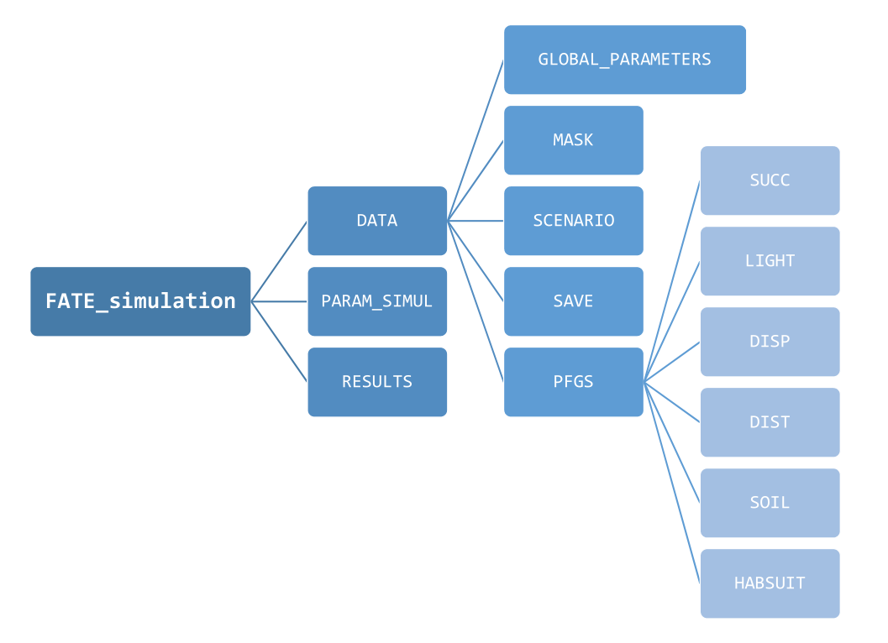

<link rel="stylesheet" href="https://use.fontawesome.com/releases/v5.0.13/css/all.css" integrity="sha384-DNOHZ68U8hZfKXOrtjWvjxusGo9WQnrNx2sqG0tfsghAvtVlRW3tvkXWZh58N9jp" crossorigin="anonymous">

<br/> <br/>


"*The recurring suggestions are that models should explicitly (i) include spatiotemporal dynamics; (ii) consider
multiple species in interactions and (iii) account for the processes shaping biodiversity distribution.*"

`FATE-HD` is a "*a biodiversity model that meets this challenge at regional scale by combining phenomenological and process-based approaches and using well-defined plant functional group*". ([Boulangeat, 2014](http://www.will.chez-alice.fr/pdf/BoulangeatGCB2014.pdf "Boulangeat, I., Georges, D., Thuiller, W., FATE-HD: A spatially and temporally explicit integrated model for predicting vegetation structure and diversity at regional scale. Global Change Biology, 20, 2368–2378."))

<br/> <br/>

# What FATE-HD needs to be run?

<br/>

### <i class="fa fa-copy"></i> The different type of parameters and *flags*

`FATE-HD` requires a quite large number of parameters, which are stored into `.txt` files, presented to and recovered by the software. These **parameters** can be of 3 types :

1. **Filenames**, to guide the application to other parameter files that should be read
2. These filenames either correspond to :
    - other parameter files that contain **values** to be actually read and used
    - **raster** files, with the extension `.tif` (lighter) or `.img`

<br/>

### <i class="fas fa-wrench"></i> How to produce all these parameters files ?

[RFate](https://mayagueguen.github.io/RFate/) is a [R](https://www.r-project.org/) package available on [github](https://github.com/MayaGueguen/RFate) and designed to provide support function to the `FATE-HD` software.

It contains documentation and functions to create and organize all input files required by the model, as well as scripts to help analyze the resulting outputs.

<br/>

### <i class="fas fa-folder-open"></i> The FATE-HD friendly directory organization

As `FATE-HD` needs quite a lot of parameters given into different parameter files, it is important to organize them in a clear and intuitive way.

While this is not mandatory to run a `FATE-HD` simulation, a specific and methodical folder architecture can be obtained with [this function](https://mayagueguen.github.io/RFate/reference/PRE_FATE.skeletonDirectory.html) from the [RFate](https://mayagueguen.github.io/RFate/) package.

A good way to start is to create this skeleton directory, and then copy or create the needed files inside to have all simulation data into the same place.

<div style="text-align:center">{width=65%}</div>

<br/> <br/>


# How to run a FATE-HD Simulation ?

<br/>

When all data and parameter files have been produced and correctly referred in a [`Simul_parameters`](https://mayagueguen.github.io/RFate/reference/PRE_FATE.params_simulParameters.html) file, a `FATE-HD` simulation can be run by just typing something like :

```R
./FATEHDD_6.0-0_UNIX <path_to_your_ParamSimul_file>
```
Then the simulation will start, and the software will print messages into the console indicating what the software is doing.   Depending on the simulation duration, the size and the resolution of the study area, the number of PFG involved, ... running the full simulation *could take a while*.

**Note :** the folder from which the command is sent must be adapted based on how paths to files have been given :

- If all paths are **absolute**  
(i.e. including the root, such as */home/username/FATE_simulation/DATA/GLOBAL_PARAMETERS/Global_parameters_V1.txt*),  
there should not be any problem. The only requirement then is to run the simulation from the folder containing the `FATE-HD` executable file, or to also give absolute path for the executable file.

- If all paths are **relative**  
(i.e. starting from a specific folder, such as *FATE_simulation/DATA/GLOBAL_PARAMETERS/Global_parameters_V1.txt*), then the `FATE-HD` simulation must be run from this specific folder (i.e. here from the folder containing the *FATE_simulation* folder).

<br/> <br/>

# How to handle the results ?

<br/>

Once the simulation is completed, the directory defined under the flag `--SAVING_DIR--` within the `Simul_parameters` file must contain the following directories :

- *ABUND_allPFG_perStrata/*
- *ABUND_perPFG_allStrata/*
- *ABUND_perPFG_perStrata/*

Each of them contains raster files with the amount of shade (which should be considered as a proxy for the vegetation coverage/abundance) contained within each pixel of the study area. The files within each folder show different informations :

- *ABUND_perPFG_perStrata/* : a file represents **one specific year**, and the amount of shade for **a specific PFG** in **a specific stratum**
- *ABUND_allPFG_perStrata/* : a file represents **one specific year**, and the amount of shade for **all PFGs** in **a specific stratum**
- *ABUND_perPFG_allStrata/* : a file represents **one specific year**, and the amount of shade for **a specific PFG** within **all strata**

These ouputs can then be used as is, or post-treated with functions from the [RFate](https://mayagueguen.github.io/RFate/) package to obtain more specific results (e.g. evolution of abundance curves, cover or diversity maps, etc).

<br/> <br/> 


<!-- **NOTE :** Sensibility analysis can be done on subset areas to try to optimise these values, but work still need to be done onto this. -->

<!-- **TO BE KEPT IN MIND :** -->

<!--   - In case one wishes to use `FATE-HD` for modeling dynamics in a specific area, PFGs need to be defined based on the species that occur in that specific area. -->
<!--   - Suitability maps can be produced using Species Distribution Models (SDM), for example. -->
<!--   - [Boulangeat, 2012](http://www.will.chez-alice.fr/pdf/Boulangeat2012GCB.pdf "Boulangeat, I., Philippe, P., Abdulhak, S., Douzet, R., Garraud, L., Lavergne, S., Lavorel, S., Van Es J., Vittoz, P. & Thuiller, W. (2012) Optimising plant functional groups for dynamic models of biodiversity: at the crossroad between functional and community ecology. Global Change Biology, 18, 3464-3475.") proposes a framework *to build meaningful PFGs that are representative of plant biodiversity, and consistent with the parameters and processes of hybrid-DVMs* ( Hybrid dynamic vegetation models of intermediate complexity). -->


